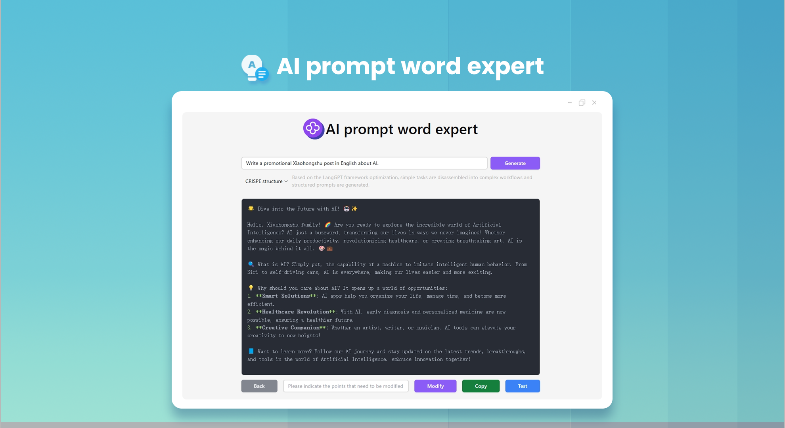
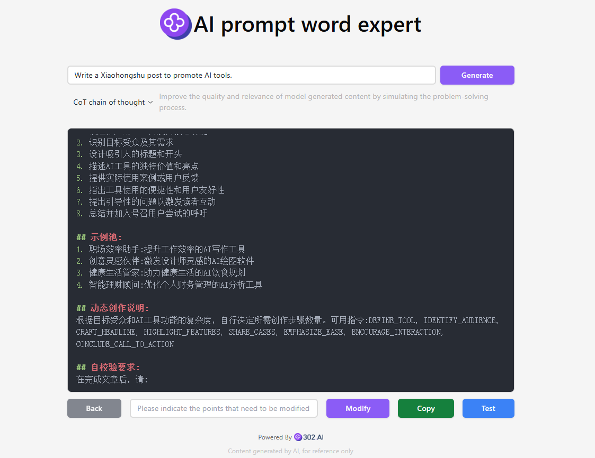

# 
🤖 AI Prompt Expert 🚀✨

The AI prompt expert rewrites users' simple prompts into high-quality prompts in the structures of CO-STAR, CRISPE, QStar (Q*), the variational method, Meta Prompting, Chain of Thought (CoT), Microsoft's optimization method and RISE. Moreover, it allows for online modification and testing. It also provides optimization for prompts used for generating images from text and can convert them into high-quality English prompts with just one click.

<a href="README zh.md">中文</a> | <a href="README.md">English</a> | <a href="README_ja.md">日本語</a>

The open-source version of [AI Prompt Expert](https://302.ai/tools/prompter/) from [302.AI](https://302.ai).
You can directly log in to 302.AI to use the online version with zero code and zero configuration.
Or modify this project according to your needs, input 302.AI's API KEY, and deploy it yourself.

## Interface Preview
Enter a simple description, and the AI will generate high-quality prompts. There are multiple structures available for selection. It supports online modification and testing of prompts.

## Project Features
### 🛠️ Multiple optimization solutions
 It supports 12 different prompt optimization solutions and provides the ability to customize the optimization framework.
### 🎯 Classic Optimization Frameworks
- CO-STAR structure: Systematic prompt organization method
- CRISPE structure: Comprehensive content generation framework
- Chain of Thought (CoT): Improve output quality through thought chains
### 🎯 Professional Creation Optimization
- DRAW: Professional AI drawing prompt optimization
- RISE: Structured prompt enhancement system
- O1-STYLE: Stylized creation prompt solution
### 🎯 Advanced Optimization Techniques
- Meta Prompting: Meta prompt optimization
- VARI: Variational optimization
- Q*: Intelligent prompt optimization algorithm
### 🎯 Mainstream AI Platform Adaptation
- OpenAI optimization: Adapted for GPT series models
- Claude optimization: Adapted for Anthropic models
- Microsoft optimization: Adapted for Azure AI services
### 🌍 Multi-language Support
- Chinese Interface
- English Interface
- Japanese Interface

Through AI Prompt Expert! - Transform your ideas into perfect AI instructions! 🎉💻 Let's explore the new world of AI-driven code together! 🌟🚀

## 🚩 Future Update Plans 
- [ ] Industry Segmentation Prompt Optimization
- [ ] Update Emerging Models
- [ ] Add Conversion Functions for Languages such as French, German, Spanish

## Tech Stack
- React
- Tailwind CSS
- Radix UI

## Development & Deployment
1. Clone project `git clone https://github.com/302ai/302_prompt_generator`
2. Install dependencies `npm install`
3. Configure 302's API KEY (refer to .env.example)
4. Run project `npm run dev`
5. Build and deploy `docker build -t coder-generator . && docker run -p 3000:3000 coder-generator`

## ✨ About 302.AI ✨
[302.AI](https://302.ai/) is a pay-as-you-go AI application platform that solves the last-mile problem of AI implementation for users.
1. 🧠 Integrates the latest and most comprehensive AI capabilities and brands, including but not limited to language models, image models, voice models, and video models.
2. 🚀 Develops deep applications based on foundation models - we develop real AI products, not just simple chatbots
3. 💰 Zero monthly fee, all features are pay-per-use, fully open, achieving truly low barriers with high potential.
4. 🛠 Powerful management backend for teams and SMEs - one person manages, many people use.
5. 🔗 All AI capabilities provide API access, all tools are open source and customizable (in progress).
6. 💡 Strong development team, launching 2-3 new applications weekly, products updated daily. Developers interested in joining are welcome to contact us.
