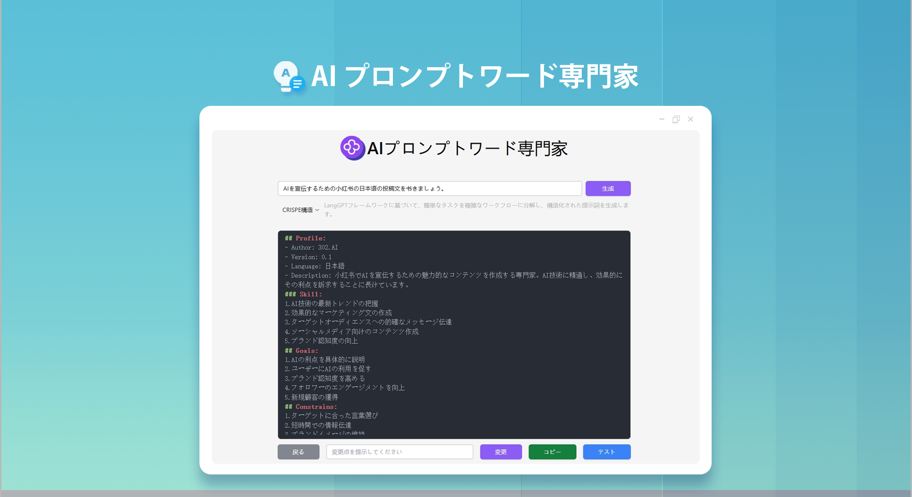

 # 
🤖 AI プロンプトエキスパート 🚀✨

AI プロンプト専門家は、ユーザーのシンプルなプロンプトを、CO-STAR、CRISPE、QStar（Q*）、変分法、Meta Prompting、思考の連鎖（CoT）、マイクロソフトの最適化法、RISE 構造の高品質なプロンプトに書き換えます。また、オンラインでの修正とテストも可能です。また、文字から画像を生成するためのプロンプトの最適化も提供し、高品質の英語のプロンプトに一括変換することができます。

<a href="README_zh.md">中文</a> | <a href="README.md">English</a> | <a href="README_ja.md">日本語</a>

これは[302.AI](https://302.ai)の[AIプロンプトエキスパート](https://302.ai/ja/tools/prompter/)のオープンソース版です。
302.AIに直接ログインして、コーディング不要で設定不要のオンラインバージョンをご利用いただけます。
また、このプロジェクトをご自身のニーズに合わせて修正し、302.AIのAPI KEYを設定して独自にデプロイすることも可能です。

## インターフェースプレビュー
シンプルな説明を入力すると、AI が高品質なプロンプトを生成します。複数の構造が選択可能です。プロンプトのオンラインでの修正とテストをサポートしています。

## プロジェクトの特徴
### 🛠️ 複数の最適化案
12 種類の異なるプロンプト最適化案をサポートし、最適化フレームワークをカスタマイズする機能を提供しています。 

### 🎯 クラシック最適化フレームワーク
- CO-STAR構造：体系的なプロンプト組織方法
- CRISPE構造：包括的なコンテンツ生成フレームワーク
- Chain of Thought (CoT)：思考連鎖による出力品質の向上
### 🎯 プロフェッショナルクリエイション最適化
- DRAW：プロフェッショナルなAIアート生成プロンプト最適化
- RISE：構造化されたプロンプト強化システム
- O1-STYLE：スタイル化クリエイションプロンプトソリューション
### 🎯 高度な最適化技術
- Meta Prompting：メタプロンプト最適化
- VARI：変分法最適化
- Q*：インテリジェントプロンプト最適化アルゴリズム
### 🎯 主要AIプラットフォーム適応
- OpenAI最適化：GPTシリーズモデル向け
- Claude最適化：Anthropicモデル向け
- Microsoft最適化：Azure AIサービス向け
### 🌍 多言語サポート
- 中国語インターフェース
- 英語インターフェース
- 日本語インターフェース

AIプロンプトエキスパートで、あなたのアイデアを完璧なAI指示に変換しましょう！ 🎉💻 AIが駆動する新しいコードの世界を一緒に探検しましょう！ 🌟🚀

## 🚩 将来のアップデート計画
- [ ] 業界細分化プロンプト最適化
- [ ] 新興モデルを更新する
- [ ] フランス語、ドイツ語、スペイン語などの言語への変換機能を追加する

## 技術スタック
- React
- Tailwind CSS
- Radix UI

## 開発とデプロイ
1. プロジェクトのクローン `git clone https://github.com/302ai/302_prompt_generator`
2. 依存関係のインストール `npm install`
3. 302のAPI KEYの設定 .env.exampleを参照
4. プロジェクトの実行 `npm run dev`
5. ビルドとデプロイ `docker build -t coder-generator . && docker run -p 3000:3000 coder-generator`

## ✨ 302.AIについて ✨
[302.AI](https://302.ai)は企業向けのAIアプリケーションプラットフォームであり、必要に応じて支払い、すぐに使用できるオープンソースのエコシステムです。✨
1. 🧠 言語モデル、画像モデル、音声モデル、動画モデルなど、最新かつ包括的なAI機能とブランドを集約
2. 🚀 基本モデルの上に深層アプリケーション開発を行い、単なるチャットボットではなく、真のAI製品を開発
3. 💰 月額料金なし、すべての機能を従量課金制で提供し、参入障壁を低く、可能性を高く
4. 🛠 チームや中小企業向けの強力な管理バックエンド、一人で管理し、多人数で利用可能
5. 🔗 すべてのAI機能にAPIアクセスを提供し、すべてのツールをオープンソースでカスタマイズ可能（進行中）
6. 💡 強力な開発チームが週に2-3個の新アプリケーションをリリース、製品は毎日更新。開発者の参加も歓迎
