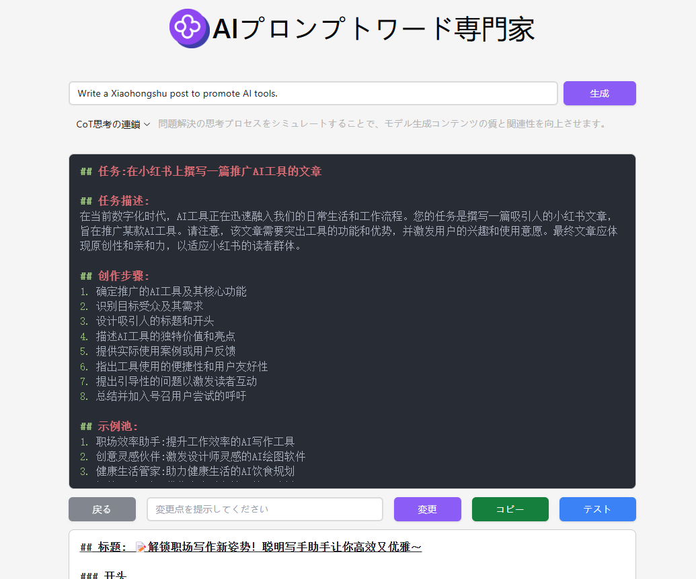

 # 💻🤖 302.AIのAIプロンプトエキスパートへようこそ！ 🚀✨

[中文](README_zh.md) | [English](README.md) | [日本語](README_ja.md)

これは[302.AI](https://302.ai)の[AIプロンプトエキスパート](https://302.ai/tools/prompter/)のオープンソース版です。
302.AIに直接ログインして、コーディング不要で設定不要のオンラインバージョンをご利用いただけます。
また、このプロジェクトをご自身のニーズに合わせて修正し、302.AIのAPI KEYを設定して独自にデプロイすることも可能です。

## ✨ 302.AIについて ✨
[302.AI](https://302.ai)は、従量課金制のAIアプリケーションプラットフォームで、AIの実践における最後の1マイルの課題を解決します。
1. 🧠 言語モデル、画像モデル、音声モデル、動画モデルなど、最新かつ包括的なAI機能とブランドを集約
2. 🚀 基本モデルの上に深層アプリケーション開発を行い、単なるチャットボットではなく、真のAI製品を開発
3. 💰 月額料金なし、すべての機能を従量課金制で提供し、参入障壁を低く、可能性を高く
4. 🛠 チームや中小企業向けの強力な管理バックエンド、一人で管理し、多人数で利用可能
5. 🔗 すべてのAI機能にAPIアクセスを提供し、すべてのツールをオープンソースでカスタマイズ可能（進行中）
6. 💡 強力な開発チームが週に2-3個の新アプリケーションをリリース、製品は毎日更新。開発者の参加も歓迎

## プロジェクトの特徴
1. 🛠️ 12種類の異なるプロンプト最適化ソリューション、カスタム最適化フレームワーク機能、多言語インターフェース対応
2. 🎯 クラシック最適化フレームワーク
    - 2.1. CO-STAR構造：体系的なプロンプト組織方法
    - 2.2. CRISPE構造：包括的なコンテンツ生成フレームワーク
    - 2.3. Chain of Thought (CoT)：思考連鎖による出力品質の向上
3. 🎯 プロフェッショナルクリエイション最適化
    - 3.1. DRAW：プロフェッショナルなAIアート生成プロンプト最適化
    - 3.2. RISE：構造化されたプロンプト強化システム
    - 3.3. O1-STYLE：スタイル化クリエイションプロンプトソリューション
4. 🎯 高度な最適化技術
    - 4.1. Meta Prompting：メタプロンプト最適化
    - 4.2. VARI：変分法最適化
    - 4.3. Q*：インテリジェントプロンプト最適化アルゴリズム
5. 🎯 主要AIプラットフォーム適応
    - 5.1. OpenAI最適化：GPTシリーズモデル向け
    - 5.2. Claude最適化：Anthropicモデル向け
    - 5.3. Microsoft最適化：Azure AIサービス向け
6. 🌐 完全な国際化：中国語、英語、日本語インターフェースの切り替えに対応

AIプロンプトエキスパートで、あなたのアイデアを完璧なAI指示に変換しましょう！ 🎉💻 AIが駆動する新しいコードの世界を一緒に探検しましょう！ 🌟🚀

## 技術スタック
- React
- Tailwind CSS
- Radix UI

## 開発とデプロイ
1. プロジェクトのクローン `git clone https://github.com/302ai/302_prompt_generator`
2. 依存関係のインストール `npm install`
3. 302のAPI KEYの設定 .env.exampleを参照
4. プロジェクトの実行 `npm run dev`
5. ビルドとデプロイ `docker build -t coder-generator . && docker run -p 3000:3000 coder-generator`

## インターフェースプレビュー

