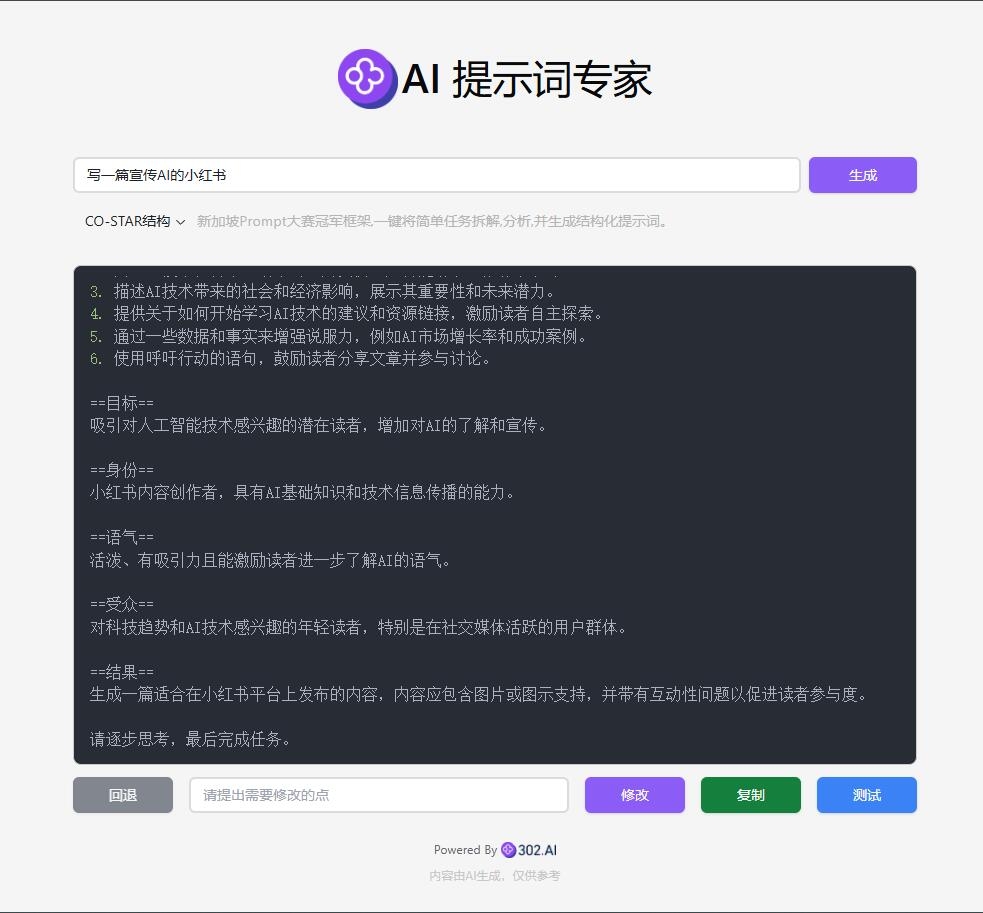

# 
🤖  AI 提示词专家 🚀✨

AI提示词专家将用户简单的提示语改写成高质量的CO-STAR、CRISPE、QStar(Q*)、变分法、Meta Prompting、CoT思维链、微软优化法和RISE结构的提示语，并且可以在线修改和测试，还提供对文字生成图片的提示语优化，可一键转换为高质量的英文提示语。

<a href="README zh.md">中文</a> | <a href="README.md">English</a> | <a href="README_ja.md">日本語</a>

来自[302.AI](https://302.ai)的[AI 提示词专家](https://302.ai/tools/prompter/)的开源版本。你可以直接登录302.AI，零代码零配置使用在线版本。或者对本项目根据自己的需求进行修改，传入302.AI的API KEY，自行部署。

## 界面预览

## 项目特性
### 🛠️ 多种优化方案
支持12种不同的提示词优化方案，提供自定义优化框架的能力。

### 🎯 经典优化框架
- C0-STAR结构:系统性的提示词组织方法
- CRISPE结构:全方位的内容生成框架
- Chain of Thought(coT):通过思维链提升输出质量
### 🎯 专业创作优化
- DRAW：专业的AI绘画提示词优化
- RISE：结构化的提示词增强系统
- O1-STYLE：风格化创作提示词方案
### 🎯 高级优化技术
- Meta Prompting：元提示词优化
- VARI：变分法优化
- Q*：智能提示词优化算法
### 🎯 主流AI平台适配
- OpenAI优化法：适配GPT系列模型
- laude优化法：适配Anthropic模型
- 微软优化法：适配Azure AI服务
### 🌍 多语言支持
- 中文界面
- English Interface
- 日本語インターフェース

通过 AI 提示词专家，将您的创意转化为完美的AI指令! 🎉💻 让我们一起探索AI驱动的代码新世界吧! 🌟🚀

## 🚩 未来更新计划
- [ ] 行业细分提示词优化
- [ ] 更新新兴模型
- [ ] 增加对法语、德语、西班牙语等语言的转换功能

## 技术栈
- React
- Tailwind CSS
- Radix UI

## 开发&部署
1. 克隆项目 `git clone https://github.com/302ai/302_prompt_generator`
2. 安装依赖 `npm install`
3. 配置302的API KEY 参考.env.example
4. 运行项目 `npm run dev`
5. 打包部署 `docker build -t coder-generator . && docker run -p 3000:3000 coder-generator`

## ✨ 302.AI介绍 ✨
[302.AI](https://302.ai)是一个按需付费的AI应用平台，为用户解决AI用于实践的最后一公里问题。
1. 🧠 集合了最新最全的AI能力和品牌，包括但不限于语言模型、图像模型、声音模型、视频模型。
2. 🚀 在基础模型上进行深度应用开发，我们开发真正的AI产品，而不是简单的对话机器人
3. 💰 零月费，所有功能按需付费，全面开放，做到真正的门槛低，上限高。
4. 🛠 功能强大的管理后台，面向团队和中小企业，一人管理，多人使用。
5. 🔗 所有AI能力均提供API接入，所有工具开源可自行定制（进行中）。
6. 💡 强大的开发团队，每周推出2-3个新应用，产品每日更新。有兴趣加入的开发者也欢迎联系我们
